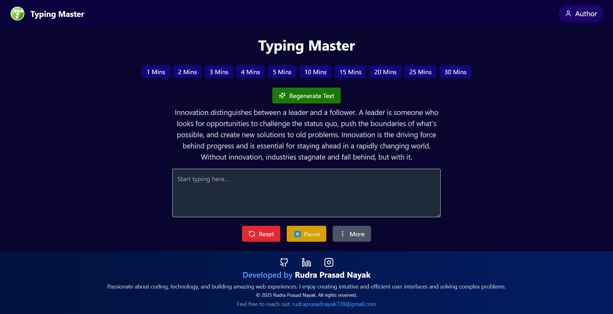

# Typing Master

**Typing Master** is a modern, responsive, and fully-featured typing test application built with React, Vite, and Tailwind CSS. It helps users practice typing, enhance their speed and accuracy, and monitor performance through real-time statistics and result summaries.

## 🚀 Features

- ⏱️ **Typing Test with Timer**: Choose a custom test duration (1 to 30 minutes) and type a randomly generated paragraph.
- 📈 **Real-Time Statistics**: Displays WPM (words per minute), character count, accuracy percentage, and error count while typing.
- 🔄 **Pause & Resume**: You can pause the test and resume without losing current progress.
- ✅ **Result Summary**: After completion, a popup displays your performance summary.
- 🔀 **Dynamic Paragraphs**: Generates new random content each session to keep the challenge fresh.
- 🧩 **Responsive UI**: Mobile-friendly design with clean layout and smooth transitions.
- 🎯 **Keyboard Navigation Support**: Enhanced accessibility with keyboard support.

## 🌐 Live Preview



## ⚙️ Installation

### Steps to Install

1. **Clone the repository**

   ```bash
   git clone https://github.com/rudra420-123/Typing_Master.git
   ```

2. **Navigate to the project folder**

   ```bash
   cd Typing_Master
   ```

3. **Install dependencies**

   ```bash
   npm install
   ```

4. **Start the development server**
   ```bash
   npm run dev
   ```

## 🧪 Usage

1. Launch the app and select your desired typing duration.
2. Start typing the paragraph shown on the screen.
3. Monitor your speed and accuracy in real-time.
4. View your results once the timer ends.
5. Switch between light and dark mode anytime using the toggle button in the navbar.

## 🔮 Future Enhancements

- 🌗 **Dark/Light Mode**
- 📝 **Custom Paragraph Input**
- 🏆 **Leaderboard for Global Scores**
- 🌍 **Multi-Language Support**
- 👤 **User Profiles with History**
- 🎓 **Typing Lessons & Challenges**
- 📱 **Mobile App Version** (React Native or Flutter)
- 🔊 **Sound Feedback for Keystrokes**
- 📊 **Charts & Analytics for Progress Tracking**

## 🤝 Contribution

Feel free to fork this repo, raise issues, or submit pull requests. All contributions are welcome!

## 🙌 Acknowledgements

- React + Vite for the lightning-fast setup
- Tailwind CSS for styling
- Lucide React Icons for clean and modern UI icons
- Free online paragraph APIs (or hardcoded demo content)

## 🔗 Connect

- **Author**: Rudra Prasad Nayak
- **GitHub**: [rudra420-123](https://github.com/rudra420-123)
- **LinkedIn**: [RudraPrasadNayak728](https://www.linkedin.com/in/RudraPrasadNayak728/)

## 📄 License

MIT License

```
Copyright (c) 2025 Rudra Prasad Nayak

GitHub: https://github.com/rudra420-123
```

See the [LICENSE](LICENSE) file for more information.

## Conclusion

Thank you for checking out the **Typing Master** app! We hope it helps you improve your typing skills. For any issues or suggestions, please open an issue on GitHub.

Enjoy Typing Master? Give it a ⭐ on GitHub!
